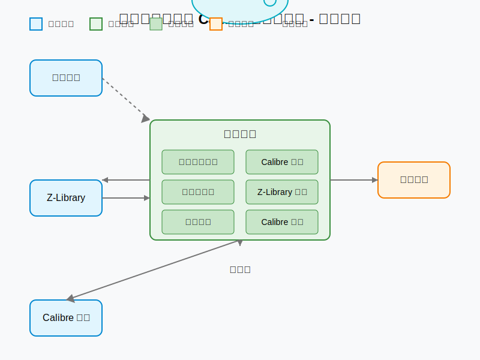

# 豆瓣书单同步与 Calibre 集成自动化


## 项目简介

「豆瓣书单同步与 Calibre 集成自动化」是一个自动化工具，用于将豆瓣「想读」书单中的书籍自动下载并添加到 Calibre 书库中。系统会定期检查豆瓣书单更新，通过 Z-Library 下载电子书，并自动上传到 Calibre 书库，最后通过飞书机器人发送通知。

### 核心功能

- **豆瓣书单同步**：自动爬取豆瓣「想读」书单
- **Calibre 书库查询**：检查书籍是否已在 Calibre 书库中
- **Z-Library 下载**：从 Z-Library 搜索并下载电子书
- **Calibre 上传**：将下载的电子书上传到 Calibre 书库
- **飞书通知**：通过飞书机器人发送任务执行结果
- **定时调度**：支持定时执行同步任务

## 系统架构



系统由以下模块组成：

1. **数据采集模块**：负责从豆瓣网站爬取「想读」书单
2. **数据库模块**：存储书籍信息和处理状态
3. **Calibre 查询模块**：查询 Calibre 书库中是否已有相应书籍
4. **Z-Library 下载模块**：从 Z-Library 搜索并下载电子书
5. **Calibre 上传模块**：将电子书上传到 Calibre 书库
6. **飞书通知模块**：发送任务执行结果通知
7. **调度系统**：管理定时任务，协调各模块工作

## 安装指南

### 系统要求

- Python 3.8 或更高版本
- Calibre 5.0 或更高版本，并启用 Content Server
- 稳定的网络连接
- 豆瓣账号
- Z-Library 账号
- 飞书机器人（可选）

### 安装步骤

1. **克隆项目**

   ```bash
   git clone https://github.com/yourusername/douban-zlib.git
   cd douban-zlib
   ```

2. **创建虚拟环境**

   ```bash
   # 使用 venv
   python -m venv venv
   
   # 激活虚拟环境
   # Windows
   venv\Scripts\activate
   # macOS/Linux
   source venv/bin/activate
   ```

3. **安装依赖**

   ```bash
   pip install -r requirements.txt
   ```

4. **配置系统**

   复制配置文件模板并编辑：

   ```bash
   cp config.yaml.example config.yaml
   # 使用文本编辑器编辑 config.yaml
   ```

5. **初始化数据库**

   ```bash
   # 创建数据目录
   mkdir -p data logs
   
   # 初始化数据库
   python -c "from db.database import Database; db = Database('sqlite:///data/douban_books.db'); db.init_db()"
   ```

6. **启动 Calibre Content Server**

   ```bash
   # 启动 Calibre Content Server，替换路径为你的书库路径
   calibre-server --port=8080 --username=your_username --password=your_password /path/to/your/calibre/library
   ```

## 使用方法

### 命令行选项

```bash
# 查看帮助
python main.py --help

# 使用指定配置文件启动
python main.py --config /path/to/config.yaml

# 立即执行同步任务
python main.py --run-now
```

### 定时执行

系统默认会按照配置文件中的调度设置定时执行同步任务。你可以在配置文件中修改执行时间：

```yaml
schedule:
  time: "03:00"  # 每天凌晨 3 点执行
```

### 日志查看

日志文件默认保存在 `logs` 目录下：

```bash
# 查看最新日志
tail -f logs/app.log
```

## 配置说明

配置文件 `config.yaml` 包含以下主要部分：

### 豆瓣配置

```yaml
douban:
  cookie: "your_cookie_here"  # 豆瓣网站 Cookie
  wishlist_url: "https://book.douban.com/people/me/wish"  # 想读书单 URL
```

### 数据库配置

```yaml
database:
  type: "sqlite"  # 数据库类型：sqlite 或 postgresql
  path: "data/douban_books.db"  # SQLite 数据库文件路径
```

### Calibre 配置

```yaml
calibre:
  content_server_url: "http://localhost:8080"  # Calibre Content Server URL
  username: "admin"  # 用户名
  password: "password"  # 密码
```

### Z-Library 配置

```yaml
zlibrary:
  username: "your_email@example.com"  # Z-Library 账号
  password: "your_password"  # 密码
  format_priority: ["epub", "mobi", "azw3", "pdf"]  # 下载格式优先级
```

### 调度配置

```yaml
schedule:
  time: "03:00"  # 每日执行时间，24小时制
  run_at_startup: false  # 是否在启动时立即执行一次
```

### 飞书通知配置

```yaml
lark:
  webhook_url: "https://open.feishu.cn/open-apis/bot/v2/hook/xxx"  # 飞书机器人 Webhook URL
  enabled: true  # 是否启用通知
```

## 开发指南

详细的开发指南请参考 [开发指南](开发指南.md) 文档，其中包含：

- 开发环境搭建
- 项目结构说明
- 代码规范
- 模块开发指南
- 测试指南
- 部署指南

## 任务执行计划

项目实施的详细任务执行计划请参考 [任务执行计划](任务执行计划.md) 文档。

## 项目结构

项目的详细目录结构和文件说明请参考 [项目结构](项目结构.md) 文档。

## 风险管理

项目实施过程中的风险识别与应对策略请参考 [风险管理计划](风险管理计划.md) 文档。

## 测试计划

项目的测试策略和测试用例请参考 [测试计划](测试计划.md) 文档。

## 贡献指南

欢迎贡献代码或提出建议！请遵循以下步骤：

1. Fork 项目
2. 创建特性分支 (`git checkout -b feature/amazing-feature`)
3. 提交更改 (`git commit -m 'Add some amazing feature'`)
4. 推送到分支 (`git push origin feature/amazing-feature`)
5. 创建 Pull Request

## 许可证

本项目采用 MIT 许可证 - 详情请参阅 [LICENSE](LICENSE) 文件。

## 联系方式

如有任何问题或建议，请通过以下方式联系我们：

- 项目维护者：[Your Name](mailto:your.email@example.com)
- 项目仓库：[GitHub Issues](https://github.com/yourusername/douban-zlib/issues)