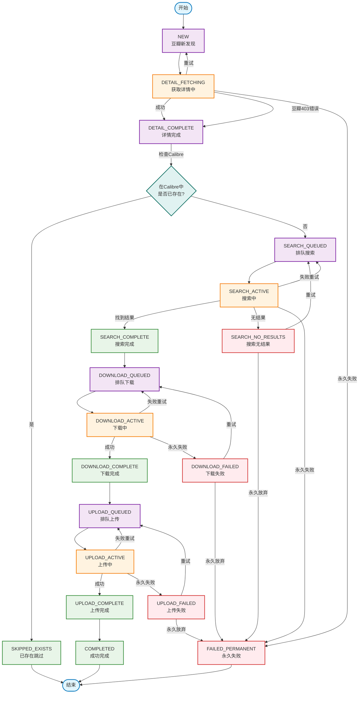
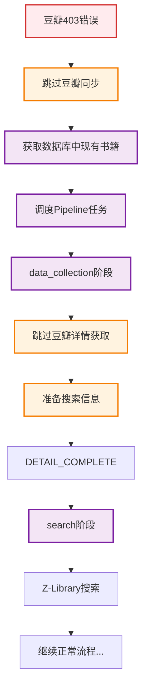

# 豆瓣Z-Library同步工具状态流程图

## 概览

本文档描述了豆瓣Z-Library同步工具V2的完整状态流程，包括正常流程和异常处理流程。

## 状态枚举定义

### 数据收集阶段
- `NEW`: 豆瓣新发现的书籍
- `DETAIL_FETCHING`: 正在获取豆瓣详细信息
- `DETAIL_COMPLETE`: 详细信息获取完成

### 搜索阶段
- `SEARCH_QUEUED`: 排队等待Z-Library搜索
- `SEARCH_ACTIVE`: 正在搜索Z-Library
- `SEARCH_COMPLETE`: 搜索完成，找到匹配结果
- `SEARCH_NO_RESULTS`: 搜索完成，无匹配结果

### 下载阶段
- `DOWNLOAD_QUEUED`: 排队等待下载
- `DOWNLOAD_ACTIVE`: 正在从Z-Library下载
- `DOWNLOAD_COMPLETE`: 下载完成
- `DOWNLOAD_FAILED`: 下载失败

### 上传阶段
- `UPLOAD_QUEUED`: 排队等待上传到Calibre
- `UPLOAD_ACTIVE`: 正在上传到Calibre
- `UPLOAD_COMPLETE`: 上传完成
- `UPLOAD_FAILED`: 上传失败

### 终态
- `COMPLETED`: 整个流程成功完成
- `SKIPPED_EXISTS`: 在Calibre中已存在，跳过处理
- `FAILED_PERMANENT`: 永久失败，不再重试

## 完整状态流程图



## Pipeline阶段对应关系

| Pipeline阶段 | 处理状态 | 成功后状态 | 失败后状态 |
|-------------|---------|-----------|-----------|
| **data_collection** | NEW | DETAIL_COMPLETE | FAILED_PERMANENT (重试时回NEW) |
| **search** | SEARCH_QUEUED | SEARCH_COMPLETE | SEARCH_NO_RESULTS |
| **download** | DOWNLOAD_QUEUED | DOWNLOAD_COMPLETE | DOWNLOAD_FAILED |
| **upload** | UPLOAD_QUEUED | UPLOAD_COMPLETE | UPLOAD_FAILED |

## 豆瓣403错误处理流程

当遇到豆瓣403访问被拒绝时，系统采用以下特殊处理流程：



## 状态转换规则

### 有效状态转换矩阵

```
FROM → TO 状态转换规则：

NEW → {DETAIL_FETCHING, SKIPPED_EXISTS, FAILED_PERMANENT}
DETAIL_FETCHING → {DETAIL_COMPLETE, FAILED_PERMANENT, NEW}
DETAIL_COMPLETE → {SEARCH_QUEUED, SKIPPED_EXISTS, FAILED_PERMANENT}

SEARCH_QUEUED → {SEARCH_ACTIVE, FAILED_PERMANENT}
SEARCH_ACTIVE → {SEARCH_COMPLETE, SEARCH_NO_RESULTS, FAILED_PERMANENT, SEARCH_QUEUED}
SEARCH_COMPLETE → {DOWNLOAD_QUEUED, FAILED_PERMANENT}
SEARCH_NO_RESULTS → {SEARCH_QUEUED, FAILED_PERMANENT}

DOWNLOAD_QUEUED → {DOWNLOAD_ACTIVE, FAILED_PERMANENT}
DOWNLOAD_ACTIVE → {DOWNLOAD_COMPLETE, DOWNLOAD_FAILED, DOWNLOAD_QUEUED}
DOWNLOAD_COMPLETE → {UPLOAD_QUEUED, FAILED_PERMANENT}
DOWNLOAD_FAILED → {DOWNLOAD_QUEUED, FAILED_PERMANENT}

UPLOAD_QUEUED → {UPLOAD_ACTIVE, FAILED_PERMANENT}
UPLOAD_ACTIVE → {UPLOAD_COMPLETE, UPLOAD_FAILED, UPLOAD_QUEUED}
UPLOAD_COMPLETE → {COMPLETED}
UPLOAD_FAILED → {UPLOAD_QUEUED, FAILED_PERMANENT}

终态：COMPLETED, SKIPPED_EXISTS, FAILED_PERMANENT (无后续转换)
```

## 错误处理和重试机制

### 1. 重试策略
- **指数退避**：失败后等待时间递增 (30s, 60s, 120s...)
- **最大重试次数**：每个任务最多重试3次
- **重试状态**：失败后回退到对应的QUEUED状态

### 2. 错误分类
- **网络错误**：可重试 (timeout, connection失败)
- **认证错误**：不可重试，直接标记FAILED_PERMANENT
- **资源不存在**：搜索阶段标记NO_RESULTS，其他阶段FAILED_PERMANENT
- **服务器错误**：可重试

### 3. 永久失败条件
- 超过最大重试次数
- 认证失败
- 数据格式错误
- 配置错误

## 监控和通知

### 飞书通知触发条件
1. **每次状态转换**：实时通知状态变化
2. **豆瓣403错误**：特殊错误通知
3. **任务完成/失败**：阶段性结果通知
4. **系统异常**：紧急错误通知

### 日志记录
- **状态变更历史**：每次转换记录到BookStatusHistory表
- **处理耗时**：记录每个阶段的执行时间
- **错误详情**：完整的异常堆栈和错误消息
- **重试记录**：重试次数和重试原因

## 性能优化

### 并发处理
- **TaskScheduler**：支持最大10个并发任务
- **优先级队列**：URGENT > HIGH > NORMAL > LOW
- **阶段隔离**：每个Pipeline阶段独立处理

### 资源管理
- **数据库连接池**：统一session管理，避免连接泄露
- **内存优化**：大文件下载使用流式处理
- **网络优化**：支持代理和限流

---

## 更新记录

- **2025-08-30**: 初始版本，包含完整状态流程设计
- **2025-08-30**: 添加豆瓣403错误处理流程
- **2025-08-30**: 完善状态转换规则和错误处理机制

---

*此文档描述了V2重构后的完整状态流程，包含19种精细化状态和完善的错误处理机制。*